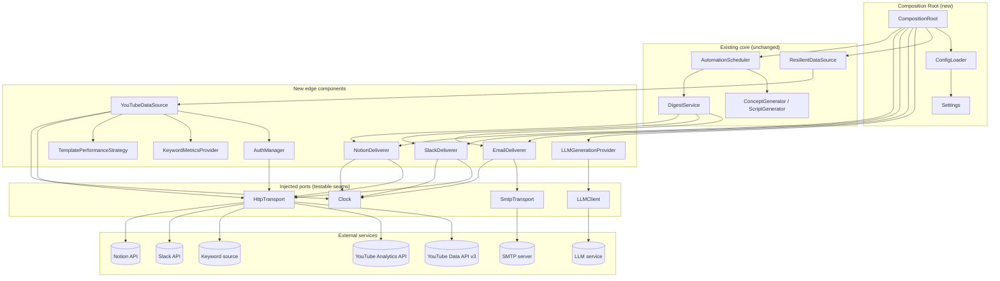
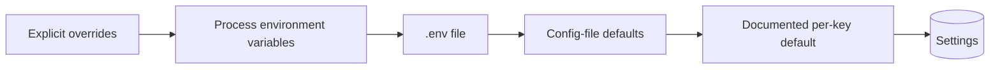

# Design Document

## Overview

The **Real Provider Integration** feature replaces the deterministic, in-memory stubs the Viral Topic Agent currently runs against (the `DummyDataSource`, the `InMemoryGenerationProvider`, and the `InMemoryDeliverer`-based `EmailDeliverer`/`SlackDeliverer`/`NotionDeliverer`) with concrete implementations that talk to real external services: a real YouTube channel, a real large language model, and real delivery destinations (email, Slack, Notion).

The integration is deliberately confined to the existing external-boundary seams. Nothing in the domain, analysis, generation-consumer, or orchestration layers changes. The new components implement protocols that already exist:

- `YouTubeDataSource` implements the existing `DataSource` protocol (`infrastructure/datasource.py`) exactly and raises the existing error hierarchy (`RateLimitError` with `retry_after_seconds`, `TransientError`, `NonTransientError`, `TimeoutError`), so the existing `ResilientDataSource` decorator keeps applying retry, rate-limit backoff, and timeout policy unchanged.
- `LLMGenerationProvider` implements the existing `GenerationProvider` protocol (`generation/provider.py`) and raises `GenerationError`, returning raw artifacts while domain validation stays in `ConceptGenerator` and `ScriptGenerator`.
- `EmailDeliverer`, `SlackDeliverer`, and `NotionDeliverer` implement the existing single-method `Deliverer` boundary (`delivery/deliverer.py`: `deliver(report) -> None`, raising `DeliveryError` on failure).

This document describes the architecture, components, interfaces, data models, correctness properties, error handling, and testing strategy that satisfy the 16 requirements in `requirements.md`.

### Design Goals

- **Drop-in conformance.** Each real provider satisfies an existing protocol without modifying the protocol definition, so the existing 33 correctness properties keep passing and the analysis/orchestration layers are untouched (Requirements 16.1, 16.2).
- **Policy stays where it lives.** The `YouTubeDataSource` only classifies and raises; it performs no retry or backoff of its own, leaving all resilience policy to `ResilientDataSource` (Requirement 16.5). The single-attempt `Deliverer` contract is preserved so `DigestService` keeps owning per-destination retry.
- **Graceful degradation preserved.** Where the public YouTube Data API cannot supply a data point (audience activity, keyword metrics, template performance), the source either degrades to empty/partial data or raises the correct classified error, so the existing `low-confidence` / `insufficient-data` / `unavailable` markers continue to apply (Requirements 3, 4, 5).
- **Secrets never leak.** Every error reason, log entry, and run/startup summary records a non-secret `CredentialReference` in place of a `Secret`; secrets are loaded from configuration at runtime and redacted everywhere else (Requirements 2.9, 6.7, 7.6, 8.7, 9.6, 11.5, 12, 13.6).
- **Dependency-free core.** Third-party client libraries are declared as exactly-pinned optional dependency extras and confined to the edge layers (infrastructure, generation, delivery). The standard library is preferred where it suffices (`smtplib`, `urllib`). The core test suite runs without installing the extras (Requirement 15).
- **Testable edges.** Each edge component accepts an injected transport/client and an injected `Clock`, so every branch (success, each error class, token refresh, redaction) is exercised without a real network request (Requirements 16.3, 16.4).

### Technology Choices

| Concern | Choice | Rationale |
|---|---|---|
| Language | **Python 3.11+** | Matches the existing codebase; standard-library HTTP and SMTP cover most edge needs. |
| HTTP transport | **`urllib.request`** (stdlib) behind an injected `HttpTransport` port | Requirement 15.3 prefers the standard library; an injected port keeps the source testable without network access (16.3) and lets a production deployment swap in a pooled client if desired. |
| YouTube Data API v3 | **REST over the `HttpTransport` port** (API key) | Public channel/video data needs only an API key; a thin REST client avoids a heavy SDK dependency for the common path. |
| YouTube Analytics API + OAuth | **Optional extra** (`google-auth` / `google-api-python-client`), pinned exactly, isolated to `infrastructure` | OAuth token refresh is tricky and risk-prone to hand-roll; the optional extra confines that complexity to the edge while keeping the core dependency-free (15.1, 15.2). |
| Email | **`smtplib` + `email.message`** (stdlib) | Standard library fully covers SMTP transmission (15.3); no third-party dependency required. |
| Slack | **REST `chat.postMessage` over `HttpTransport`** (stdlib `urllib`) | A single POST with a bearer token; no SDK needed. |
| Notion | **REST `pages.create` over `HttpTransport`** (stdlib `urllib`) | A single POST against the Notion API version header; no SDK needed. |
| LLM | **REST chat-completions over `HttpTransport`**, behind an injected `LLMClient` port | Keeps the provider vendor-neutral and testable; the concrete vendor is a configuration detail. |
| Config & secrets | **Layered `ConfigLoader` over ordered `ConfigurationSource`s** | The Creator asked about env vars and a better alternative; layering keeps the convenient `.env` flow for local dev while supporting real env vars or an external secret provider in production (Requirement 10), with startup validation (Requirement 11). |
| Property-based testing | **Hypothesis** | Matches the existing suite; used for the pure logic in this feature (error mapping, `.env` parsing, precedence, redaction, report rendering). |
| Example/unit testing | **pytest** | Matches the existing suite; used for transport-stubbed branches and integration smoke checks. |

Concrete vendor choices (which LLM, which SMTP host) are configuration values, not design commitments: they sit behind the `HttpTransport`, `LLMClient`, and SMTP ports.

## Architecture

The Real Provider Integration adds an **edge layer** that plugs into the existing seams. The diagram below shows only the new components (bold) and the existing seams they satisfy; everything above the seams is unchanged.



### Layer placement and the dependency policy (Requirement 15)

| New component | Layer / package | Third-party imports |
|---|---|---|
| `YouTubeDataSource`, `AuthManager`, `HttpTransport`, `KeywordMetricsProvider`, `TemplatePerformanceStrategy` | `infrastructure/` | `urllib` (stdlib); OAuth via the optional `youtube` extra, imported lazily inside `AuthManager` only |
| `LLMGenerationProvider`, `LLMClient` | `generation/` | `urllib` (stdlib) or an optional vendor extra, isolated to the client |
| `EmailDeliverer` | `delivery/` | `smtplib`, `email` (stdlib) |
| `SlackDeliverer`, `NotionDeliverer` | `delivery/` | `urllib` (stdlib) |
| `ConfigLoader`, `Settings`, `ConfigurationSource`, `CompositionRoot` | `config/` (new) + `app/` (new entry point) | stdlib only |

The `domain/` and `analysis/` layers gain **no** new imports. The optional extras are declared in `pyproject.toml` under `[project.optional-dependencies]` (e.g. `youtube = ["google-auth==X.Y.Z", "google-api-python-client==A.B.C"]`), each pinned to an exact version. Because the only third-party imports live at the edges and the OAuth import is performed lazily inside `AuthManager`, the core test suite imports nothing third-party when the extras are absent (15.4); a core module that incorrectly imported an extra would fail with an `ImportError` rather than be silently guarded (15.5).

### Configuration precedence (Requirement 10)

`ConfigLoader` assembles `Settings` by consulting `ConfigurationSource`s in a fixed order of **decreasing** precedence:



For each documented configuration key, the loader takes the value from the highest-precedence source that supplies it; if none does and a default is defined, the default is used. This keeps the convenient env-var/`.env` flow for local development while allowing real environment variables or an external secret provider in production.

### Startup flow (Requirements 11, 14)

```mermaid
sequenceDiagram
    participant App as Entry point
    participant CR as CompositionRoot
    participant CL as ConfigLoader
    participant YDS as YouTubeDataSource
    participant Sched as AutomationScheduler

    App->>CR: start()
    CR->>CL: load() + validate()
    alt one or more required values missing/malformed
        CL-->>CR: ValidationReport (all keys, secrets redacted)
        CR-->>App: abort — scheduler never runs, no external request
    else all required values present and well-formed
        CL-->>CR: Settings (validated)
        CR->>YDS: construct (+ AuthManager, transports, Clock)
        CR->>CR: construct ResilientDataSource(YDS), LLMGenerationProvider, selected Deliverers
        CR->>CR: build Configuration from Settings
        alt construction of a required component fails
            CR-->>App: report failed component; scheduler never runs
        else
            CR->>Sched: run(Configuration, Clock, manual=…)
        end
    end
```

Validation happens **before** any component is constructed and before any external request is issued (11.1, 11.2). All missing/malformed keys are reported together (11.2), each delivery destination selected in `Settings` is validated and unselected destinations are treated as not required (11.3, 11.4), and every report excludes secret values (11.5, 12.2).

## Components and Interfaces

All new components are constructor-injected with their transport/client port and (where time matters) a `Clock`, so tests exercise them without network access (16.3, 16.4).

### HttpTransport (port) — `infrastructure/http_transport.py`

A minimal synchronous HTTP port so the YouTube/Slack/Notion edges are testable. It does **no** retry or backoff (that is `ResilientDataSource`'s job, 16.5); it simply performs one request and returns a structured response or signals a transport-level failure.

```python
@dataclass(frozen=True)
class HttpResponse:
    status: int
    headers: Mapping[str, str]      # case-insensitive lookup
    body: bytes

class HttpTransport(Protocol):
    def request(
        self,
        method: str,
        url: str,
        *,
        headers: Mapping[str, str] = ...,
        body: bytes | None = None,
        timeout_seconds: float | None = None,
    ) -> HttpResponse: ...
    # Raises HttpTransportError for connection failure/reset and
    # HttpTimeoutError when the response does not complete within timeout.
```

- `UrllibHttpTransport` is the production implementation over `urllib.request` (stdlib, 15.3).
- `FakeHttpTransport` (tests) returns scripted `HttpResponse`s or raises `HttpTransportError` / `HttpTimeoutError` to drive every error-mapping branch.

### YouTubeDataSource — `infrastructure/youtube_data_source.py`

Implements the `DataSource` protocol exactly (1.1, 16.1). It owns request shaping, response parsing, pagination, and **error classification only** (16.5).

```python
class YouTubeDataSource:  # satisfies DataSource (structural)
    def __init__(
        self,
        transport: HttpTransport,
        auth: AuthManager,
        clock: Clock,
        *,
        api_base_url: str,
        request_timeout_seconds: float,
        keyword_provider: KeywordMetricsProvider | None = None,
        template_strategy: TemplatePerformanceStrategy | None = None,
        max_items: int = 50,
    ) -> None: ...

    def get_channel_metadata(self, channel_id: str) -> ChannelMetadata: ...
    def get_videos(self, channel_id: str, published_within_days: int | None = None) -> list[VideoStats]: ...
    def get_audience_activity(self, channel_id: str, days: int) -> AudienceActivity: ...
    def get_keyword_metrics(self, category: ChannelCategory, max_keywords: int) -> list[KeywordMetric]: ...
    def get_template_performance(self, category: ChannelCategory) -> list[TemplatePerformance]: ...
```

Responsibilities:

- **Channel metadata (1.2, 1.6, 1.7):** retrieve title, subscriber count, video count; map a retrieved topic/category to a supported `ChannelCategory` when possible, otherwise leave `detected_category` unset.
- **Videos (1.3, 1.4, 1.5):** return one `VideoStats` per retrieved video with id, view count, ISO-8601 `published_at`; when `published_within_days=N` is supplied, return only videos whose published instant is within `[now - N days, now]`, using the injected `Clock` for `now` (16.4); with no `N`, return all without time filtering.
- **Pagination (1.8):** follow `nextPageToken` until the API reports no further page or the accumulated item count reaches `max_items`, whichever comes first.
- **Audience activity (Requirement 3):** delegate authentication to `AuthManager`; require OAuth for the owned channel; build an `AudienceActivity` whose buckets carry `day_of_week ∈ [0,6]`, `hour ∈ [0,23]`, non-negative `activity`, and `days_covered` bounded to `[0, days]`. Missing OAuth → `NonTransientError`; empty-but-successful → zero-coverage `AudienceActivity`.
- **Keyword metrics (Requirement 4):** delegate to the configured `KeywordMetricsProvider`; cap results at `max_keywords`; return `[]` when no provider is configured.
- **Template performance (Requirement 5):** delegate to the configured `TemplatePerformanceStrategy` over retrieved video stats; return `[]` when no strategy is configured.
- **Error mapping (Requirement 2):** see the dedicated table in Error Handling. The source raises only members of the existing hierarchy and never retries internally (16.5). Every reason string is built through `redact(...)` so no secret appears (2.9).

### AuthManager — `infrastructure/auth_manager.py`

Selects and applies the right credential per request and manages OAuth refresh (Requirement 13).

```python
class AuthManager:
    def __init__(self, settings: AuthSettings, transport: HttpTransport, clock: Clock) -> None: ...
    def data_api_params(self) -> Mapping[str, str]: ...        # API key for YouTube Data API (13.1)
    def analytics_auth_header(self, channel_id: str) -> Mapping[str, str]: ...  # OAuth bearer (13.2)
    def refresh_access_token(self, channel_id: str) -> None: ...  # 13.3
```

- Public Data API requests authenticate with the configured API key (13.1); Analytics requests use the owned channel's OAuth credentials (13.2).
- On an Analytics "access token expired" response **with** a refresh token, obtain a new access token and let the caller reissue the failed request exactly once (13.3). Refresh failure, or expiry **without** a refresh token, raises a `NonTransientError` identifying the owned channel and indicating re-authorization is required (13.4, 13.7).
- An invalid Data API key surfaces as a `NonTransientError` whose reason says the key is invalid (13.5).
- Token acquisition/refresh excludes every secret from logs (13.6); the OAuth library import is lazy and confined here (15.2).

### KeywordMetricsProvider / TemplatePerformanceStrategy — `infrastructure/`

Configurable seams for the two data points the public API cannot supply directly.

```python
class KeywordMetricsProvider(Protocol):
    def fetch(self, category: ChannelCategory, max_keywords: int) -> list[KeywordMetric]: ...

class TemplatePerformanceStrategy(Protocol):
    def derive(self, category: ChannelCategory, videos: list[VideoStats]) -> list[TemplatePerformance]: ...
```

When unconfigured, `YouTubeDataSource` returns an empty list for the corresponding call (4.3, 5.3) — preserving graceful degradation. When configured and the underlying retrieval fails, the failure is mapped to the appropriate `DataSourceError` (4.4, 5.4).

### LLMGenerationProvider — `generation/llm_generation_provider.py`

Implements `GenerationProvider` (6.1, 16.1) over an injected `LLMClient` port.

```python
class LLMClient(Protocol):
    def complete(self, prompt: str, *, n: int = 1, timeout_seconds: float | None = None) -> tuple[str, ...]: ...

class LLMGenerationProvider:  # satisfies GenerationProvider (structural)
    def __init__(self, client: LLMClient, *, request_timeout_seconds: float) -> None: ...
    def generate_titles(self, idea: ContentIdea, count: int) -> tuple[str, ...]: ...
    def generate_thumbnails(self, idea: ContentIdea, count: int) -> tuple[ThumbnailDraft, ...]: ...
    def generate_outline(self, idea: ContentIdea) -> str: ...
    def generate_script(self, idea: ContentIdea) -> str: ...
    def generate_description(self, idea: ContentIdea) -> str: ...
```

- Requests `N` candidates for titles/thumbnails; returns one artifact per produced item (6.2, 6.3); thumbnails carry a non-empty visual description and a text overlay.
- Returns the LLM's raw artifacts **without** enforcing domain title-distinctness, length, overlay-length, or description-length constraints — those stay in the consumers (6.5).
- Raises `GenerationError` (naming the failed item and the affected `ContentIdea.idea_id`, no partial artifact) when the request fails, times out, returns zero items, or returns only empty/whitespace content (6.6). A `count < 1` for titles/thumbnails raises `GenerationError` **without** issuing an LLM request (6.8). Every reason is redacted (6.7).

### Deliverers — `delivery/email_deliverer.py`, `slack_deliverer.py`, `notion_deliverer.py`

Each implements the single-method `Deliverer` boundary, preserving the one-attempt contract so `DigestService` keeps owning retry (Requirements 7, 8, 9).

```python
class EmailDeliverer:   # satisfies Deliverer
    def __init__(self, smtp: SmtpTransport, settings: EmailSettings, renderer: DigestRenderer) -> None: ...
    def deliver(self, report: DigestReport) -> None: ...

class SlackDeliverer:   # satisfies Deliverer
    def __init__(self, transport: HttpTransport, settings: SlackSettings, renderer: DigestRenderer) -> None: ...
    def deliver(self, report: DigestReport) -> None: ...

class NotionDeliverer:  # satisfies Deliverer
    def __init__(self, transport: HttpTransport, settings: NotionSettings, renderer: DigestRenderer) -> None: ...
    def deliver(self, report: DigestReport) -> None: ...
```

- Each renders the report and verifies all three sections are present (including the `no-items` indicator for any empty section) **before** transmitting/posting/recording (7.2, 7.4, 8.2, 8.4, 9.2, 9.4). Rendering is centralized in a shared pure `DigestRenderer` so the "three sections + no-items indicators" guarantee is implemented once.
- On success, `deliver` returns `None` (7.3, 8.3, 9.3).
- On transmission failure, each raises `DeliveryError` with a redacted reason (7.5, 7.6, 8.5, 8.7, 9.5, 9.6). For Slack, if a `DeliveryError` cannot be constructed/raised after a posting failure, the deliverer logs a delivery-failed entry identifying the destination and still surfaces a failure to the caller (8.6).

### SmtpTransport (port) — `delivery/smtp_transport.py`

A thin port over `smtplib` (15.3) so email transmission is testable. `FakeSmtpTransport` records sent messages or raises to exercise the failure path.

### DigestRenderer — `delivery/digest_renderer.py`

A pure function from `DigestReport` to a rendered payload (subject/body for email, blocks for Slack, properties for Notion) that guarantees all three sections and the per-empty-section `no-items` indicator. Shared by all three deliverers; the single target of the rendering properties.

### ConfigLoader, Settings, ConfigurationSource — `config/`

```python
class ConfigurationSource(Protocol):
    def values(self) -> Mapping[str, str]: ...   # documented keys -> raw string values

@dataclass(frozen=True)
class Settings:
    # Non-secret config + CredentialReferences; secrets held in a separate
    # SecretStore keyed by reference, never rendered.
    ...

class ConfigLoader:
    def __init__(self, sources: Sequence[ConfigurationSource]) -> None: ...   # highest precedence first
    def load(self) -> Settings: ...
    def validate(self, settings: Settings) -> ValidationReport: ...
```

- Sources in precedence order: `OverridesSource`, `EnvSource`, `DotEnvSource`, `ConfigFileSource` (10.1, 10.2), with documented per-key defaults (10.3).
- `DotEnvSource` parses `.env`: lines whose first non-whitespace char is `#` are comments; blank lines are ignored; every other line is `KEY=VALUE` split at the first `=`, with key and value trimmed (10.4). A non-blank, non-comment line with no `=` is reported as malformed by line number and contributes no value (10.6).
- Each value maps to its `Settings` field by the documented key (10.5).
- `validate` checks every required key for each enabled component is present and well-formed (non-empty, correct type/format) and returns a `ValidationReport` listing **all** problems by key, with secrets redacted (11.1, 11.2, 11.3, 11.4, 11.5, 12.5).

### CompositionRoot — `app/composition_root.py`

The single entry point that reads `Settings`, wires the real components, builds a `Configuration`, and runs the `AutomationScheduler` (Requirement 14). It constructs `ResilientDataSource(YouTubeDataSource(...))` (14.1), the `LLMGenerationProvider`, and one `Deliverer` per selected destination (14.2); builds a `Configuration` from `Settings` (14.3); then runs the scheduler on the configured `Schedule`, or manual-only when no complete schedule is configured (14.4, 14.5, 14.6). If any required component fails to construct, the scheduler never runs and the failure is reported identifying the component — including when the reporting itself fails (14.7).

## Data Models

The feature reuses all existing domain models unchanged (`ChannelMetadata`, `VideoStats`, `AudienceActivity`, `HourlyActivity`, `KeywordMetric`, `TemplatePerformance`, `DigestReport`, `Configuration`, `Schedule`, `DeliveryDestination`, etc.) and the existing error types (`RateLimitError`, `TransientError`, `NonTransientError`, `TimeoutError`, `GenerationError`, `DeliveryError`). It introduces only the configuration/secret and transport models below.

### Secret and CredentialReference (Requirement 12)

```python
@dataclass(frozen=True)
class CredentialReference:
    """A non-secret handle naming a secret; safe to log and summarize."""
    name: str            # e.g. "youtube_api_key", "smtp_password"

class Secret:
    """Wraps a secret value. __repr__/__str__ return a redacted placeholder so
    the value cannot leak through logs, f-strings, or tracebacks."""
    def __init__(self, value: str, reference: CredentialReference) -> None: ...
    def reveal(self) -> str: ...      # explicit, used only at the transport boundary
    @property
    def reference(self) -> CredentialReference: ...
    def __repr__(self) -> str: return f"<Secret {self.reference.name}>"
    __str__ = __repr__
```

`Secret` deliberately makes the value reachable only through the explicit `reveal()` call, used solely where a transport must send it; everywhere else (logs, reports, error reasons) the redacted reference is what renders. A module-level `redact(text, secrets)` helper scrubs any secret value that might otherwise appear in a free-form reason string (12.3).

### Settings and component settings

```python
@dataclass(frozen=True)
class AuthSettings:
    youtube_api_key: Secret
    oauth: OAuthCredentials | None        # present when Analytics is authorized

@dataclass(frozen=True)
class OAuthCredentials:                    # Requirement 13
    client_id: str
    client_secret: Secret
    refresh_token: Secret | None
    access_token: Secret | None

@dataclass(frozen=True)
class EmailSettings:
    host: str; port: int; username: str
    password: Secret; sender: str; recipient: str

@dataclass(frozen=True)
class SlackSettings:
    token: Secret; channel: str; api_base_url: str

@dataclass(frozen=True)
class NotionSettings:
    token: Secret; database_id: str; api_version: str; api_base_url: str

@dataclass(frozen=True)
class Settings:
    auth: AuthSettings
    llm_timeout_seconds: float
    request_timeout_seconds: float
    keyword_source: KeywordSourceSettings | None
    template_strategy: TemplateStrategySettings | None
    email: EmailSettings | None
    slack: SlackSettings | None
    notion: NotionSettings | None
    # The fields needed to build a domain Configuration:
    authorized_channels: tuple[AuthorizedChannel, ...]
    selected_category: ChannelCategory | None
    monitored_competitors: tuple[str, ...]
    schedule: Schedule | None
    delivery_destinations: tuple[DeliveryDestination, ...]
```

### ValidationReport (Requirement 11)

```python
@dataclass(frozen=True)
class ConfigProblem:
    key: str                 # the documented configuration key (never the value)
    issue: str               # "missing" | "malformed: <expected form>"

@dataclass(frozen=True)
class ValidationReport:
    problems: tuple[ConfigProblem, ...]
    @property
    def ok(self) -> bool: return not self.problems
```

`ConfigProblem` identifies a value by key only; secret values never appear in a report (11.5, 12.5).

### Mapping requirement value-objects to existing models

| Requirement term | Existing model | Notes |
|---|---|---|
| ChannelMetadata (1.2) | `domain.models.ChannelMetadata` | `detected_category` set only when topic maps to a supported category (1.6, 1.7) |
| VideoStats (1.3) | `domain.models.VideoStats` | `published_at` is ISO-8601 |
| AudienceActivity / HourlyActivity (3) | `domain.models.AudienceActivity`, `HourlyActivity` | `days_covered ∈ [0, days]`; buckets validated to `day∈[0,6]`, `hour∈[0,23]`, `activity≥0` |
| KeywordMetric (4) | `domain.models.KeywordMetric` | capped at `max_keywords` |
| TemplatePerformance (5) | `domain.models.TemplatePerformance` | all fields populated incl. per-format averages |
| DigestReport (7,8,9) | `domain.models.DigestReport` | exactly three sections, rendered by `DigestRenderer` |
| Configuration (14) | `domain.models.Configuration` | built from `Settings` by `CompositionRoot` |

## Correctness Properties

*A property is a characteristic or behavior that should hold true across all valid executions of a system — essentially, a formal statement about what the system should do. Properties serve as the bridge between human-readable specifications and machine-verifiable correctness guarantees.*

This feature is largely pure logic at testable seams: HTTP error classification, ISO-8601 time filtering, pagination, category mapping, `.env` parsing, configuration precedence, secret redaction, digest rendering, and generation pass-through. Each edge component accepts an injected transport/client and `Clock`, so these properties are exercised against fakes with no real network access (16.3, 16.4). The properties below were derived from the acceptance-criteria prework and consolidated to remove redundancy: every per-status error-mapping criterion folds into one ordered-mapping property (Property 5), every per-deliverer rendering criterion folds into one shared-renderer property (Property 13), and every per-output redaction criterion folds into one redaction property (Property 17). Conformance checks, happy-path branches, specific OAuth-refresh scenarios, wiring, and dependency-policy checks are covered by the example/integration/smoke tests in the Testing Strategy rather than by properties.

### Property 1: Channel metadata mirrors the retrieved channel data

*For any* successful YouTube Data API channel response, `get_channel_metadata` SHALL return exactly one `ChannelMetadata` whose `channel_id` equals the requested identifier and whose title, subscriber count, and video count equal the corresponding retrieved values.

**Validates: Requirements 1.2**

### Property 2: Detected category is set if and only if the retrieved topic maps to a supported category

*For any* retrieved channel topic/category value, `get_channel_metadata` SHALL set `detected_category` to a supported `ChannelCategory` when the value maps to one, and SHALL leave `detected_category` unset otherwise.

**Validates: Requirements 1.6, 1.7**

### Property 3: Video retrieval maps one-to-one and applies exact recency filtering

*For any* set of retrieved videos and any optional `published_within_days = N`, `get_videos` SHALL return one `VideoStats` per retrieved video (each carrying the video id, view count, and ISO-8601 published timestamp) filtered to exactly those whose published instant lies within `[now − N days, now]` when `N` is supplied (using the injected `Clock` for `now`), and to the full retrieved set when `N` is not supplied.

**Validates: Requirements 1.3, 1.4, 1.5**

### Property 4: Pagination stops at the first of no-further-page or the maximum item count

*For any* multi-page retrieval and any maximum item count `M`, `YouTubeDataSource` SHALL request successive pages until the API reports no further page or the accumulated item count reaches `M`, whichever occurs first, and SHALL return no more than `M` items.

**Validates: Requirements 1.8**

### Property 5: Every error response maps to exactly one error-hierarchy member by the documented precedence

*For any* failure signal from a YouTube endpoint (an HTTP error status, a transport connection error/reset, or a non-completing response) the source SHALL raise exactly one member of the `DataSourceError` hierarchy chosen by evaluating, in order, the rate-limit conditions (HTTP 429, or 403 with a quota/rate reason → `RateLimitError`), then the authorization condition (HTTP 400/401/404, or 403 with an auth/permission reason → `NonTransientError` naming the request), then the server-error condition (HTTP ≥ 500 → `TransientError`), then the timeout condition (no complete response within the configured timeout → `TimeoutError`), then connection failures (→ `TransientError`), and finally any other HTTP error status (→ `NonTransientError` naming the request and the received status).

**Validates: Requirements 2.1, 2.2, 2.5, 2.6, 2.7, 2.8, 2.10, 2.11, 3.5, 4.4, 5.4**

### Property 6: Rate-limit `retry_after_seconds` reflects a numeric Retry-After header exactly

*For any* rate-limit response, the raised `RateLimitError` SHALL have `retry_after_seconds` set to the header's value when the response includes a `Retry-After` header carrying a numeric seconds value, and SHALL leave `retry_after_seconds` unset when no such header is present or the header does not carry a numeric seconds value.

**Validates: Requirements 2.3, 2.4**

### Property 7: The data source performs no internal retry or backoff

*For any* call that fails, `YouTubeDataSource` SHALL make exactly one transport attempt, SHALL NOT call `Clock.sleep`, and SHALL signal the failure only by raising a member of the `DataSourceError` hierarchy — leaving all retry, backoff, and timeout policy to `ResilientDataSource`.

**Validates: Requirements 16.5**

### Property 8: Audience activity has valid buckets and bounded coverage

*For any* successful YouTube Analytics response for an authorized owned channel, `get_audience_activity` SHALL return an `AudienceActivity` whose `channel_id` equals the requested owned-channel identifier, whose every hourly bucket carries a `day_of_week` in 0–6, an `hour` in 0–23, and a non-negative activity value, and whose `days_covered` is bounded between 0 and the requested number of days (0 with empty buckets when the response contains no activity data).

**Validates: Requirements 3.1, 3.2, 3.6**

### Property 9: Keyword metrics map one-to-one within the requested maximum

*For any* configured `KeywordMetricsProvider` result and requested maximum keyword count, `get_keyword_metrics` SHALL return one `KeywordMetric` per retrieved keyword (carrying its demand and competition values) and SHALL return no more than the requested maximum.

**Validates: Requirements 4.1, 4.2**

### Property 10: Template performance maps one-to-one with all fields populated

*For any* configured `TemplatePerformanceStrategy` applied to retrieved video statistics, `get_template_performance` SHALL return one `TemplatePerformance` per derived template, each populating the template identifier, the channel category, the observed performance, the sample size, the Short-format average view count, and the long-form-format average view count.

**Validates: Requirements 5.1, 5.2**

### Property 11: Generation returns the LLM's raw artifacts unmodified

*For any* successful LLM output, `LLMGenerationProvider` SHALL return one artifact per produced item — one title string per title candidate, one `ThumbnailDraft` (with a non-empty visual description and a text overlay) per thumbnail concept, and the produced artifact string for outline/script/description — without enforcing the domain title-distinctness, title-length, thumbnail-overlay-length, or description-length constraints.

**Validates: Requirements 6.2, 6.3, 6.4, 6.5**

### Property 12: Generation failure conditions raise without partial output or a wasted request

*For any* generation request that fails, does not complete within the configured timeout, returns zero items, or returns only empty/whitespace content, `LLMGenerationProvider` SHALL raise a `GenerationError` identifying the failed item and the affected `ContentIdea` identifier and SHALL NOT return a partial artifact; and *for any* title/thumbnail count less than 1 it SHALL raise such a `GenerationError` without issuing any request to the LLM.

**Validates: Requirements 6.6, 6.8**

### Property 13: Digest rendering always produces three sections with correct no-items indicators

*For any* `DigestReport`, the shared rendering used by the email, Slack, and Notion deliverers SHALL include all three report sections and SHALL include the no-items indicator for exactly those sections that contain zero items, and each deliverer SHALL perform this render-and-verify before attempting transmission, posting, or recording.

**Validates: Requirements 7.2, 7.4, 8.2, 8.4, 9.2, 9.4**

### Property 14: Configuration precedence selects the highest-precedence value or the defined default

*For any* assignment of configuration keys across the ordered sources (explicit overrides, process environment, `.env` file, configuration-file defaults), `ConfigLoader` SHALL resolve each key to the value from the highest-precedence source that supplies it, and SHALL fall back to the defined default for a key absent from every source.

**Validates: Requirements 10.1, 10.2, 10.3**

### Property 15: `.env` parsing follows the comment, blank-line, KEY=VALUE, and malformed-line rules

*For any* `.env` file content, the parser SHALL ignore lines whose first non-whitespace character is `#` and blank lines, SHALL parse every other line as a KEY=VALUE pair split at the first equals sign with surrounding whitespace trimmed from key and value, and SHALL report every non-blank, non-comment line that contains no equals sign as malformed identified by its line number while contributing no value from that line.

**Validates: Requirements 10.4, 10.6**

### Property 16: Startup validation reports exactly the missing or malformed required keys and blocks all external requests

*For any* configuration in which a subset of the required keys for the enabled components and selected delivery destinations is missing or malformed, `ConfigLoader.validate` SHALL produce a report whose identified keys are exactly that subset (treating the keys of unselected delivery destinations as not required), SHALL prevent the `AutomationScheduler` from running, and SHALL cause no external request to be issued.

**Validates: Requirements 11.1, 11.2, 11.3, 11.4, 12.5**

### Property 17: No secret value appears in any rendered output

*For any* secret-bearing operation — a raised `DataSourceError`, `GenerationError`, or `DeliveryError` reason; a configuration validation report; a startup or run summary; or a token acquisition/refresh log entry — the rendered output SHALL contain no secret value and SHALL use the corresponding `CredentialReference` in its place.

**Validates: Requirements 2.9, 6.7, 7.6, 8.7, 9.6, 11.5, 12.1, 12.2, 12.3, 13.6**

### Property 18: The built Configuration faithfully reflects the Settings

*For any* validated `Settings`, the `Configuration` built by the `CompositionRoot` SHALL carry the authorized channels, the selected `ChannelCategory`, the monitored competitor channels, the `Schedule`, and the delivery destinations equal to the corresponding values in those `Settings`.

**Validates: Requirements 14.3**

## Error Handling

Error handling preserves the existing system's three rules: expected degraded states are returned as data (empty lists, status markers) rather than exceptions; all `DataSource` access still flows through `ResilientDataSource`, which remains the single place that classifies, retries, and records failures; and a failure is contained to the smallest unit possible. The new edge components add **classification and redaction** but no retry or policy of their own.

### YouTube error mapping (Requirement 2)

`YouTubeDataSource` evaluates failure signals in this fixed precedence and maps each to exactly one hierarchy member (Property 5). It never retries internally (Property 7).

| Condition (evaluated in order) | Raised error | Notes |
|---|---|---|
| HTTP 429 | `RateLimitError` | `retry_after_seconds` from a numeric `Retry-After`, else unset (2.3, 2.4) |
| HTTP 403 with quota/rate reason | `RateLimitError` | same `Retry-After` handling |
| HTTP 400/401/404, or 403 with auth/permission reason | `NonTransientError` | reason names the failing request (2.8); invalid API key reason for a rejected key (13.5) |
| HTTP ≥ 500 | `TransientError` | server error (2.7) |
| No complete response within `request_timeout_seconds` | `TimeoutError` | a `TransientError` subtype (2.5) |
| Transport connection error/reset | `TransientError` | network failure (2.6) |
| Any other HTTP error status | `NonTransientError` | reason names request + received status (2.11) |

The same mapping applies to the Analytics endpoint (3.5) and to failures surfaced by a configured `KeywordMetricsProvider` (4.4) or `TemplatePerformanceStrategy` retrieval (5.4). Every reason string is built through `redact(...)` so no secret leaks (2.9, Property 17). `ResilientDataSource` then applies its existing retry/backoff/timeout policy to whatever is raised, unchanged.

### Audience activity and OAuth (Requirements 3, 13)

- Missing OAuth for the owned channel → `NonTransientError` indicating Analytics authorization is required (3.3).
- Analytics auth/permission error → `NonTransientError` naming the owned channel, returning no `AudienceActivity` (3.4).
- Expired access token **with** refresh token → `AuthManager` refreshes and the caller reissues exactly once (13.3). Refresh failure, or expiry **without** a refresh token → `NonTransientError` naming the channel and indicating re-authorization (13.4, 13.7).

### Generation (Requirement 6)

- Request failure, timeout, zero items, or empty/whitespace-only content → `GenerationError` naming the failed item and idea, with no partial artifact (6.6).
- `count < 1` for titles/thumbnails → `GenerationError` with no LLM request issued (6.8).
- All reasons redacted (6.7).

### Delivery (Requirements 7, 8, 9)

- Each deliverer attempts exactly one delivery and raises `DeliveryError` on failure with a redacted reason, preserving the single-attempt contract so `DigestService` keeps owning per-destination retry.
- Slack additionally guarantees that if a `DeliveryError` cannot be constructed/raised after a posting failure, it logs a delivery-failed entry naming the destination and still surfaces a failure to the caller (8.6).

### Configuration and composition (Requirements 11, 12, 14)

- `ConfigLoader.validate` collects **all** missing/malformed required keys into one `ValidationReport` (keys only, secrets redacted), prevents the scheduler from running, and issues no external request (11.2, 11.5, 12.5).
- `CompositionRoot` aborts without running the scheduler if any required component fails to construct, reporting the failing component — and still prevents the run even when reporting itself fails (14.7).

## Testing Strategy

The feature is tested with the same dual approach as the existing codebase: **property-based tests** verify the universal properties above across large generated input spaces, and **example / integration / smoke tests** cover conformance, happy-path branches, specific OAuth scenarios, wiring, latency, and the dependency policy. All tests run against injected fakes (`FakeHttpTransport`, `FakeSmtpTransport`, a spy `LLMClient`, and `FakeClock`) so no real network access is required (16.3, 16.4).

### Property-Based Tests

- **Library:** Hypothesis (Python), matching the existing suite. Property tests SHALL NOT reimplement a PBT engine.
- **Iterations:** each property test runs a minimum of 100 examples (`@settings(max_examples=100)` or higher).
- **Traceability tag:** each property test is tagged with a comment in the format
  `# Feature: real-provider-integration, Property {number}: {property_text}`.
- **One test per property:** each of Properties 1–18 is implemented by a single property-based test.
- **Generators (composite strategies):**
  - `channel_response` / `video_page` — YouTube Data API JSON payloads with random titles, counts, ISO-8601 timestamps (straddling the recency window), topics (mapped and unmapped), and `nextPageToken` chains of varying length, to drive Properties 1–4.
  - `error_signal` — a union of HTTP error statuses (including overlapping cases such as 403-quota vs 403-auth and arbitrary unmatched statuses), transport connection errors, and non-completing responses, with optional numeric / non-numeric / absent `Retry-After` headers, to drive Properties 5, 6, 7.
  - `analytics_response` — Analytics payloads including empty-but-successful data, to drive Property 8.
  - `keyword_result` / `video_stats` — provider/strategy inputs sized around the `max_keywords` bound, to drive Properties 9, 10.
  - `llm_output` — outputs spanning valid artifacts, domain-bound-violating artifacts, empty/whitespace, and zero-item results, plus counts below 1, to drive Properties 11, 12.
  - `digest_report` — reports with each of the three sections independently empty or populated, to drive Property 13.
  - `source_assignment` — random assignments of configuration keys across the four sources (including absences), to drive Property 14.
  - `dotenv_text` — `.env` content mixing comments, blank lines, surrounding whitespace, values containing `=`, and malformed (no-`=`) lines at random positions, to drive Property 15.
  - `required_key_subset` — configurations with random subsets of required keys removed/corrupted across enabled components and selected destinations, to drive Property 16.
  - `secret_bearing_output` — secrets embedded into candidate error reasons, reports, summaries, and log lines, to drive Property 17.
  - `settings` — full `Settings` spanning empty and maximal channel/competitor/destination sets, with and without a complete schedule, to drive Property 18.
- **Determinism:** the LLM client, HTTP transport, SMTP transport, and `Clock` are replaced with deterministic fakes so the properties test our logic, not third-party behavior.

### Example and Edge-Case Unit Tests

Targeted tests cover the conformance, happy-path, and specific branches flagged in the prework:

- **Protocol conformance (1.1, 6.1, 7.1, 8.1, 9.1, 16.1):** assert `YouTubeDataSource`, `LLMGenerationProvider`, and each deliverer satisfy the existing `runtime_checkable` protocols without modifying them.
- **Degradation branches (4.3, 5.3):** unconfigured keyword provider / template strategy return `[]`.
- **Audience branches (3.3, 3.4):** missing OAuth and Analytics auth error each raise the documented `NonTransientError`.
- **Delivery happy/failure paths (7.3, 7.5, 8.3, 8.5, 8.6, 9.3, 9.5):** succeeding fakes return `None`; failing fakes raise `DeliveryError`; the Slack error-construction-failure fallback logs and surfaces a failure.
- **Auth scenarios (13.1, 13.2, 13.3, 13.4, 13.5, 13.7):** spy transport confirms API-key vs OAuth selection; scripted responses drive expired→refresh→reissue-once, refresh-failure, invalid-key, and expired-without-refresh.
- **`.env` field mapping (10.5)** and **validation happy path (11.6):** documented keys map to the right `Settings` fields; a complete valid config validates and allows the run.
- **Composition wiring (14.1, 14.2, 14.4, 14.5, 14.6, 14.7):** the root builds `ResilientDataSource(YouTubeDataSource)`, one deliverer per selected destination, runs the scheduler with the constructed components, honors schedule vs manual-only, and aborts (reporting the component) on construction failure including a nested reporting failure.
- **Edge isolation (15.5):** core modules import successfully without the optional extras installed.

### Integration and Smoke Tests

- **Existing suite regression (16.2):** run the full existing test suite and confirm all 33 correctness properties still pass after the feature is added.
- **Extras-free core run (15.4):** run the core suite in an environment without the optional extras and assert it completes without importing any third-party client library.
- **Dependency policy (15.1, 15.2, 15.3):** smoke tests parse `pyproject.toml` to confirm each third-party client library is declared as an exactly-pinned optional extra, and scan `domain/` and `analysis/` sources to confirm they import no third-party client library.
- **Secret hygiene (12.4):** smoke test asserting `.env` and any local credential file are excluded from version control.
- **OAuth refresh integration (13.3):** an example-backed integration test over the scripted transport verifying a single refresh and a single reissue end-to-end through `AuthManager`.

These integration and smoke checks are intentionally **not** property-based: they verify external-service wiring, one-time configuration, and environment setup, where input variation adds no value (per the prework classifications).
