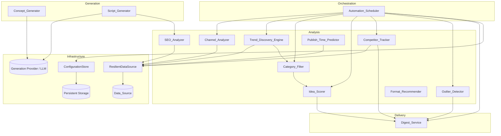
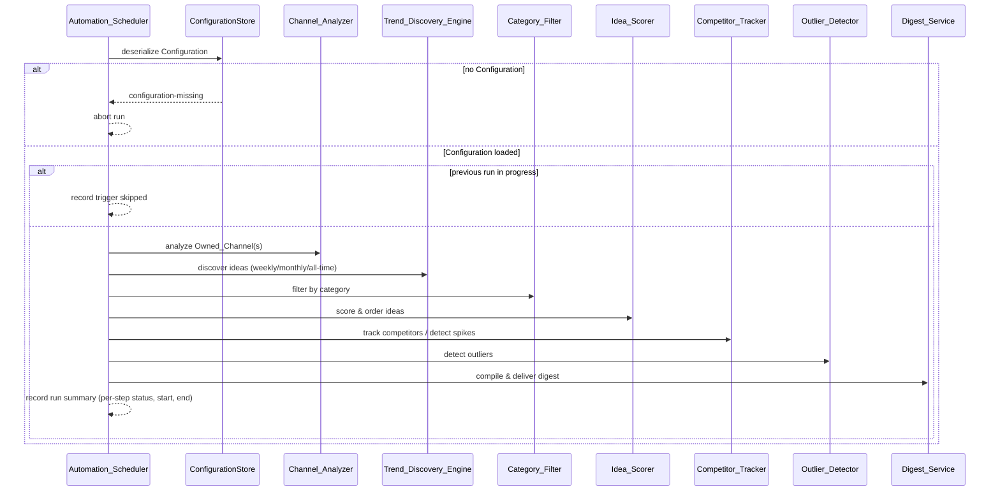
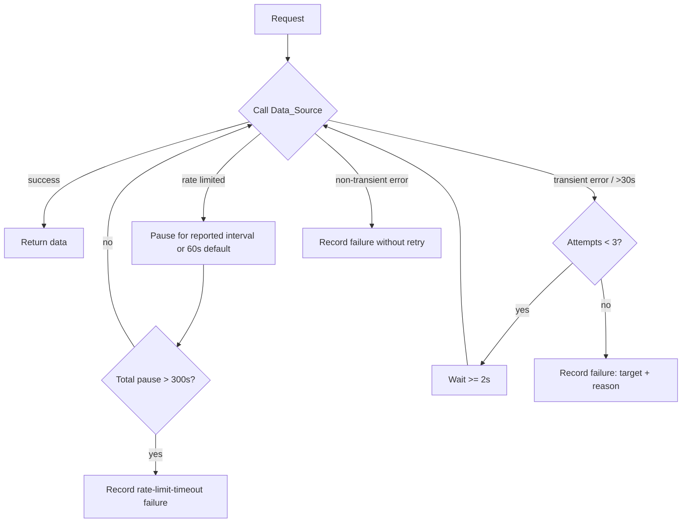

# Design Document

## Overview

The Viral Topic Agent is an automated pipeline that analyzes a Creator's owned YouTube channel(s), discovers trending and historically viral content ideas across multiple time windows, scores those ideas for the specific channel, tracks competitor channels for performance spikes, detects outlier videos, generates production-ready assets (titles, thumbnails, scripts, SEO tags, descriptions), recommends publish times and formats, performs SEO keyword-gap analysis, and delivers a recurring digest to one or more destinations. The whole flow runs on a schedule with minimal manual intervention.

This document describes the architecture, components, interfaces, data models, correctness properties, error handling, and testing strategy that satisfy the 16 requirements in `requirements.md`.

### Design Goals

- **Resilience first.** Every interaction with the external `Data_Source` flows through a single resilience layer that implements retries, rate-limit backoff, and timeouts (Requirement 16). A failure of one request never silently corrupts unrelated results.
- **Component isolation.** Each analytical component (analyzer, scorer, detector, etc.) is a pure-logic unit that consumes already-retrieved data and produces a deterministic result. Side effects (network, persistence, delivery) live at the edges. This makes the bulk of the system property-testable.
- **Graceful degradation.** Partial data produces partial results with explicit status markers (low-confidence, insufficient-data, unavailable) rather than hard failures, except where a requirement mandates withholding output.
- **Deterministic ordering and bounds.** Ranked outputs (scored ideas, keyword gaps) have well-defined, total ordering with explicit tie-breaks, and all counts/lengths obey the documented bounds.
- **Round-trip integrity.** Configuration serialization is lossless and field-by-field reversible (Requirement 15.4).

### Technology Choices

| Concern | Choice | Rationale |
|---|---|---|
| Language | **Python 3.11+** | Strong data-analysis ecosystem, first-class typing via dataclasses, mature property-testing tooling. |
| Property-based testing | **Hypothesis** | De-facto standard PBT library for Python; supports `@settings(max_examples=100)` and composite strategies for structured data. |
| Example/unit testing | **pytest** | Integrates with Hypothesis; clear fixtures for integration boundaries. |
| Data validation / models | **dataclasses** (+ explicit `(de)serialize` functions) | Keeps the round-trip property explicit and under our control rather than hidden in a framework. |
| Serialization format | **JSON** | Human-inspectable, ubiquitous, and supports the round-trip requirement when paired with explicit encoders. |
| Scheduling | Pluggable `Clock` + cron-style interval; an OS scheduler or APScheduler drives the trigger | Keeps scheduling logic testable by abstracting time. |

Implementation choices for the external data provider (e.g., the YouTube Data API) and the LLM used for generation are kept behind the `Data_Source` and generation interfaces respectively, so the provider can change without affecting domain logic.

## Architecture

The system is organized into five layers. Domain logic depends only on inward (more abstract) layers; infrastructure concerns sit at the edges.



### Layer Responsibilities

- **Orchestration** (`Automation_Scheduler`): owns the schedule, prevents overlapping runs, runs steps in the mandated order, builds a run summary, and short-circuits dependent steps on failure (Requirement 14).
- **Analysis**: pure transformations over retrieved data. Each component takes already-fetched data plus parameters and returns a structured result. These are the primary targets for property-based testing.
- **Generation**: produces creative assets via an external generation provider, wrapped behind an interface so tests can inject deterministic stubs.
- **Delivery** (`Digest_Service`): compiles results into a report and delivers to each destination independently with per-destination retry.
- **Infrastructure**:
  - `ResilientDataSource` decorates the raw `Data_Source` and centralizes retry, rate-limit backoff, timeout handling, and transient/non-transient classification (Requirement 16). All analysis components call the `Data_Source` only through this decorator.
  - `ConfigurationStore` serializes/deserializes `Configuration` to persistent storage with round-trip integrity (Requirement 15).

### End-to-End Scheduled Run Sequence



### Resilience Flow (Data_Source access)



## Components and Interfaces

All interfaces are described in Python-style signatures. Components in the Analysis layer are pure with respect to their inputs: they receive retrieved data (or a `ResilientDataSource` handle) and return result objects; they raise no uncaught exceptions for expected degraded states, instead returning result objects carrying status markers.

### Data_Source (abstraction)

The single external dependency for YouTube data. The concrete provider is selected at deployment time.

```python
class DataSource(Protocol):
    def get_channel_metadata(self, channel_id: str) -> ChannelMetadata: ...
    def get_videos(self, channel_id: str, published_within_days: int | None = None) -> list[VideoStats]: ...
    def get_audience_activity(self, channel_id: str, days: int) -> AudienceActivity: ...
    def get_keyword_metrics(self, category: ChannelCategory, max_keywords: int) -> list[KeywordMetric]: ...
    def get_template_performance(self, category: ChannelCategory) -> list[TemplatePerformance]: ...
```

Any call may raise a `DataSourceError` subtype (`RateLimitError`, `TransientError`, `NonTransientError`, `TimeoutError`). Components never call a `DataSource` directly; they call it through `ResilientDataSource`.

### ResilientDataSource (infrastructure)

Decorates a `DataSource` and enforces Requirement 16. Returns a `Result[T, DataSourceFailure]` so callers can branch without exception handling.

```python
@dataclass
class RetryPolicy:
    max_attempts: int = 3            # total attempts including the first
    min_backoff_seconds: float = 2.0 # minimum wait between retries (16.2)
    request_timeout_seconds: float = 30.0  # (16.4)
    default_rate_limit_pause_seconds: float = 60.0  # (16.1)
    max_total_pause_seconds: float = 300.0  # (16.5)

class ResilientDataSource:
    def __init__(self, inner: DataSource, policy: RetryPolicy, clock: Clock): ...
    def call(self, request: DataRequest) -> Result[Any, DataSourceFailure]: ...
```

Behavior:
- **Rate limit** (16.1): on `RateLimitError`, pause for the provider-reported interval, or `default_rate_limit_pause_seconds` if none reported, then resume. If cumulative pause exceeds `max_total_pause_seconds`, record a `rate-limit-timeout` failure (16.5).
- **Transient** (16.2, 16.4): network timeout, connection reset, temporary-unavailability response, or no complete response within `request_timeout_seconds` are transient. Retry up to `max_attempts`, waiting at least `min_backoff_seconds` between attempts.
- **Non-transient** (16.3): authentication rejection, invalid-request, or target-not-found are recorded immediately without retry, with target + reason.
- **Failure recording** (16.6): every recorded failure includes the request target and failure reason.
- **Independence** (16.7): each `call` is independent; the caller continues with requests that do not depend on a failed one.

### Connection_Manager

Owns channel authorization and connection lifecycle (Requirement 1). It mediates between the Creator's authorization grant, the credential store inside `Configuration`, and the `ResilientDataSource`.

```python
class ConnectionManager:
    MAX_OWNED_CHANNELS = 50
    AUTH_REQUEST_TIMEOUT_SECONDS = 5.0    # time to issue the auth request (1.1)
    AUTH_DECISION_TIMEOUT_SECONDS = 300.0 # time to await grant/deny (1.7)

    def initiate_connection(self, channel_id: str, clock: Clock) -> AuthorizationResult: ...
    def complete_authorization(self, channel_id: str, grant: AuthorizationGrant,
                               config: Configuration) -> AuthorizationResult: ...
    def retrieve_with_credentials(self, channel: AuthorizedChannel,
                                  request: DataRequest,
                                  source: ResilientDataSource,
                                  clock: Clock) -> Result[Any, ConnectionError]: ...
```

Behavior:
- Issues the authorization request within 5 s of initiation (1.1).
- On grant, stores authorization credentials in `Configuration` and marks the channel `connected` (1.2). If storing fails, records `credential-storage-failed`, returns an error indicating the credentials were not saved, and leaves the channel **not** connected (1.8).
- On denial, records `authorization-failed` and never attempts data retrieval (1.3). If neither grant nor deny arrives within 300 s, records `authorization-timeout` and never attempts retrieval (1.7).
- For a valid-credential data request, retrieves the data within 30 s (1.4, enforced via `ResilientDataSource` timeout). If credentials are expired, returns `authorization-expired` identifying the affected channel (1.5).
- Supports up to 50 authorized `Owned_Channel`s and tags every retrieved data set with its originating channel id (1.6).
- On `Data_Source` unavailability/error, relies on `ResilientDataSource` to retry up to 3 attempts; if all fail, returns `data-retrieval-failed` identifying the channel and retains the stored credentials (1.9).

### Channel_Analyzer

```python
class ChannelAnalyzer:
    def analyze(self, channel_id: str, source: ResilientDataSource) -> Result[ChannelProfile, DataRetrievalError]: ...

# Baseline computation is a pure function, extracted for direct property testing:
def compute_baseline_view_count(view_counts: list[int]) -> BaselineResult:
    """Median of most-recent up-to-N counts; status reflects sample size."""
```

- Retrieves metadata, video list, per-video view counts (2.1).
- Computes `Baseline_View_Count` as the median of the most recent 30 published videos, or all videos if fewer than 30 (2.2).
- Produces a `ChannelProfile` with detected category, subscriber count, video count, baseline (2.3).
- Zero videos → baseline `UNAVAILABLE` (2.4); 1–4 videos → baseline `LOW_CONFIDENCE` (2.7); partial failure → build from retrieved data and record reason (2.5); no data → `DataRetrievalError` with channel id + reason (2.6).

### Trend_Discovery_Engine

```python
class TrendDiscoveryEngine:
    def discover(self, source: ResilientDataSource,
                 windows: set[TimeWindow] = ALL_WINDOWS) -> DiscoveryResult: ...
```

- For each requested `Time_Window` produces 1–20 `Content_Idea`s (3.1), each associated with 1–5 `Viral_Template`s (3.2) and carrying its `Time_Window` plus a rationale referencing at least one observed metric value within that window (3.3).
- No data for all windows → empty result per window (3.4); no data for one window → empty for that window, 1–20 for the rest (3.5); specific window requested → results for it, empty for others (3.6); window times out/unavailable → empty for that window + error indication + results for others (3.7).

### Category_Filter

```python
class CategoryFilter:
    SUPPORTED = {GAMING, MUSIC, ENTERTAINMENT, SPORTS}
    def filter(self, ideas: list[ContentIdea], templates: list[ViralTemplate],
               selected: ChannelCategory | None,
               detected: ChannelCategory | None) -> FilterResult: ...
```

- Selected category → only matching ideas + templates (4.1). No selection but detected category → apply detected (4.2). Supports gaming/music/entertainment/sports (4.3). No matching ideas but matching templates → return templates (4.4). No matches at all → empty + no-matches indicator (4.5). Unsupported selected category → `unsupported-category` error (4.6). No selection and no detected → `category-unavailable` indicator and no filtering applied (4.7).

### Idea_Scorer

```python
class IdeaScorer:
    def score(self, ideas: list[ContentIdea], profile: ChannelProfile,
              category_aggregate: CategoryAggregate | None) -> list[ScoredIdea]: ...

def compute_idea_score(idea: ContentIdea, baseline: BaselineResult,
                       category_aggregate: CategoryAggregate | None) -> ScoreOutcome:
    """Returns an integer 0..100 with a confidence marker, or withheld+insufficient-data."""
```

- Assigns an integer `Idea_Score` in [0, 100] (5.1), computed from the channel baseline and each associated template's observed performance (5.2).
- Orders ideas by descending score, breaking ties by descending associated template observed performance (5.3).
- Baseline unavailable/zero → use category aggregate, mark `LOW_CONFIDENCE` (5.4); both unavailable → withhold score + `insufficient-data` indicator identifying the idea (5.5).

### Competitor_Tracker

```python
class CompetitorTracker:
    MAX_COMPETITORS = 50
    def add_competitor(self, config: Configuration, channel_id: str) -> AddResult: ...
    def monitor(self, config: Configuration, source: ResilientDataSource) -> list[CompetitorReport]: ...
```

- Add stores a not-yet-present competitor in `Configuration` (6.1); rejects when already 50 are monitored with a `limit-reached` indication (6.8).
- Monitoring retrieves each competitor's trailing-30-day videos + view counts (6.2), computes that competitor's baseline (6.3), and flags any video whose view count is > 0 and ≥ 3× the baseline as a spike (6.4), recording channel id, video id, view count, and spike factor (6.5).
- Competitor with < 5 retrieved videos → `insufficient-data`, skip spike detection, continue others (6.6); unavailable competitor → `unavailable` status, continue others (6.7).

### Outlier_Detector

```python
class OutlierDetector:
    def detect(self, channel_id: str, videos: list[VideoStats]) -> OutlierResult: ...
```

- Computes baseline from up to the 50 most recent published videos (7.1).
- When baseline > 0 and a video view count > 0 and the ratio ≥ 5.0, classifies the video as an outlier with `outlier_factor = view_count / baseline` (7.2, 7.3).
- < 5 published videos → `insufficient-data`, no outliers (7.4); baseline zero/unavailable → `insufficient-data`, no outliers (7.5).

### Concept_Generator

```python
class ConceptGenerator:
    def generate(self, idea: ContentIdea, gen: GenerationProvider) -> Result[ConceptSet, ConceptError]: ...
```

- ≥ 3 distinct title concepts (8.1); ≥ 1 thumbnail concept with visual description + text overlay ≤ 30 chars (8.2); each title 1–100 chars inclusive (8.3); concepts match the idea's category when present (8.4). If it cannot produce the required set, returns no partial concepts and an error identifying the idea (8.5).

### Publish_Time_Predictor

```python
class PublishTimePredictor:
    def predict(self, channel_id: str, source: ResilientDataSource,
                tz: ZoneInfo | None,
                category_activity: AudienceActivity | None) -> Result[PublishRecommendation, NoDataError]: ...
```

- Retrieves ≥ 7 days of audience activity (9.1); recommends exactly one day-of-week and exactly one contiguous window 1–3 hours long, in the Creator's time zone (9.2) or UTC if none configured (9.3). Retrieval failure → retry up to 3 total attempts, else `audience-data-retrieval` error with channel id (9.4). Owned-channel activity unavailable → derive from category aggregate, mark `low-confidence` (9.5); both unavailable → `no-data` error, no recommendation (9.6).

### Script_Generator

```python
class ScriptGenerator:
    def generate(self, idea: ContentIdea, seo_keywords: list[str],
                 gen: GenerationProvider) -> Result[ScriptBundle, ScriptError]: ...
```

- Produces outline, script draft, SEO tags, description within 60 s (10.1). SEO tags include every keyword supplied by `SEO_Analyzer` and total 5–30 (10.2). Description 100–5000 chars (10.3). No keywords from `SEO_Analyzer` → produce outline/script/description and indicate SEO tags unavailable (10.4). On failure → error identifying the failed item and retain the selected idea for retry (10.5).

### SEO_Analyzer

```python
class SEOAnalyzer:
    def analyze(self, category: ChannelCategory, source: ResilientDataSource) -> KeywordGapResult: ...

def classify_keyword_gaps(keywords: list[KeywordMetric]) -> KeywordGapResult:
    """Pure percentile classification + ordering."""
```

- Retrieves up to 1,000 candidate keywords within 10 s (11.1). With ≥ 4 analyzed keywords, classifies a keyword as a gap when its demand ≥ 50th percentile and competition ≤ 50th percentile (11.2). Orders gaps by descending demand, ties broken by ascending competition (11.3). No gaps → empty + `no-gap` (11.4). Data_Source error → no result, retain previous results, error indication (11.5). < 4 candidates → empty + `insufficient-data` (11.6).

### Format_Recommender

```python
class FormatRecommender:
    def recommend(self, idea: ContentIdea,
                  short_views: list[int], long_views: list[int]) -> FormatResult: ...
```

- With ≥ 5 short-format and ≥ 5 long-format template videos, recommends exactly one format (12.1), choosing the higher observed average view count (12.2), defaulting to Short on a tie (12.3), with a rationale citing both averages (12.4). Fewer than 5 in either format → withhold + `insufficient-performance-data` (12.5).

### Digest_Service

```python
class DigestService:
    SUPPORTED = {EMAIL, SLACK, NOTION}
    def compile(self, scored: list[ScoredIdea], spikes: list[CompetitorSpike],
                outliers: list[Outlier]) -> DigestReport: ...
    def deliver(self, report: DigestReport, config: Configuration,
                deliverers: dict[DeliveryDestination, Deliverer]) -> list[DeliveryOutcome]: ...
```

- Compiles scored ideas, spikes, outliers into one report with a distinct section per item type (13.1); a section with zero items carries a `no-items` indicator (13.2). Delivers to each configured destination (13.3); supports email/Slack/Notion (13.5). No destination configured → no delivery + `no-destination-configured` status (13.4). Delivery failure → retry up to 3 total attempts per destination, record per-destination `delivery-failed` if all fail (13.6); destinations are independent so one failure does not block others (13.7).

### Automation_Scheduler

```python
class AutomationScheduler:
    STEP_ORDER = [CHANNEL_ANALYSIS, TREND_DISCOVERY, CATEGORY_FILTER,
                  IDEA_SCORING, COMPETITOR_TRACKING, OUTLIER_DETECTION, DIGEST_DELIVERY]
    def set_schedule(self, config: Configuration, schedule: Schedule) -> ScheduleResult: ...
    def run(self, config: Configuration, clock: Clock) -> RunSummary: ...
```

- Valid schedule (interval + run time) stored in `Configuration` (14.1); missing interval or run time → reject, do not store, error naming the missing field (14.2). A run executes the steps in the mandated order (14.3). Overlapping trigger while a run is in progress → not started concurrently, recorded as skipped (14.4). A failed step → record failure, skip steps whose input depends on its output, continue independent steps (14.5). Completed run → `RunSummary` with each step's status (succeeded/failed/skipped) plus start and completion times (14.6). No schedule configured → run only on manual trigger (14.7).

### ConfigurationStore

```python
class ConfigurationStore:
    def save(self, config: Configuration) -> SaveResult: ...
    def load(self) -> Result[Configuration, ConfigError]: ...

def serialize_config(config: Configuration) -> str: ...      # to JSON
def deserialize_config(blob: str) -> Configuration: ...        # from JSON
```

- Serializes authorized channels, selected category, monitored competitors, schedule, delivery destinations to persistent storage (15.1); on successful write sets status `saved` (15.2). On run start, deserializes existing config (15.3). Round-trip is field-by-field lossless (15.4). Corrupt/unreadable config → `configuration-invalid` error naming the failing setting, do not start, do not overwrite (15.5). Serialize/write failure → `configuration-save` error naming the failing setting, retain previous config unchanged (15.6). No persisted config on run start → `configuration-missing` notification, do not start (15.7).

## Data Models

```python
from dataclasses import dataclass, field
from enum import Enum

class ChannelCategory(Enum):
    GAMING = "gaming"
    MUSIC = "music"
    ENTERTAINMENT = "entertainment"
    SPORTS = "sports"

class TimeWindow(Enum):
    WEEKLY = "weekly"       # trailing 7 days
    MONTHLY = "monthly"     # trailing 30 days
    ALL_TIME = "all_time"

class Confidence(Enum):
    NORMAL = "normal"
    LOW = "low_confidence"
    UNAVAILABLE = "unavailable"

class VideoFormat(Enum):
    SHORT = "short"
    LONG_FORM = "long_form"

class DeliveryDestination(Enum):
    EMAIL = "email"
    SLACK = "slack"
    NOTION = "notion"

@dataclass(frozen=True)
class VideoStats:
    video_id: str
    view_count: int
    published_at: str          # ISO-8601
    format: VideoFormat | None = None

@dataclass(frozen=True)
class BaselineResult:
    value: float | None        # median; None when unavailable
    confidence: Confidence     # NORMAL, LOW (1-4 videos), UNAVAILABLE (0 videos)
    sample_size: int

@dataclass(frozen=True)
class ChannelProfile:
    channel_id: str
    detected_category: ChannelCategory | None
    subscriber_count: int
    video_count: int
    baseline: BaselineResult
    partial_failure_reason: str | None = None

@dataclass(frozen=True)
class ViralTemplate:
    template_id: str
    name: str                  # e.g. "tier-list ranking", "reaction"
    category: ChannelCategory
    observed_performance: float # aggregate observed view performance

@dataclass(frozen=True)
class ContentIdea:
    idea_id: str
    title_concept: str
    rationale: str
    time_window: TimeWindow
    category: ChannelCategory | None
    templates: tuple[ViralTemplate, ...]    # length 1..5
    observed_metric_value: float            # referenced metric within the window

@dataclass(frozen=True)
class DiscoveryResult:
    ideas_by_window: dict[TimeWindow, tuple[ContentIdea, ...]]
    window_errors: dict[TimeWindow, str]    # window -> error indication

@dataclass(frozen=True)
class FilterResult:
    ideas: tuple[ContentIdea, ...]
    templates: tuple[ViralTemplate, ...]
    no_matches: bool = False
    category_unavailable: bool = False
    applied_category: ChannelCategory | None = None
    error: str | None = None                # unsupported-category

@dataclass(frozen=True)
class ScoredIdea:
    idea: ContentIdea
    score: int | None          # 0..100, or None when withheld
    confidence: Confidence
    insufficient_data: bool = False

@dataclass(frozen=True)
class CompetitorSpike:
    channel_id: str
    video_id: str
    view_count: int
    spike_factor: float        # view_count / baseline, >= 3.0

@dataclass(frozen=True)
class CompetitorReport:
    channel_id: str
    status: str                # ok | insufficient-data | unavailable
    baseline: BaselineResult | None
    spikes: tuple[CompetitorSpike, ...]

@dataclass(frozen=True)
class Outlier:
    video_id: str
    view_count: int
    outlier_factor: float      # view_count / baseline, >= 5.0

@dataclass(frozen=True)
class OutlierResult:
    channel_id: str
    insufficient_data: bool
    baseline: BaselineResult | None
    outliers: tuple[Outlier, ...]

@dataclass(frozen=True)
class TitleConcept:
    text: str                  # 1..100 chars

@dataclass(frozen=True)
class ThumbnailConcept:
    visual_description: str
    text_overlay: str          # <= 30 chars

@dataclass(frozen=True)
class ConceptSet:
    idea_id: str
    titles: tuple[TitleConcept, ...]       # >= 3 distinct
    thumbnails: tuple[ThumbnailConcept, ...] # >= 1
    category: ChannelCategory | None

@dataclass(frozen=True)
class PublishRecommendation:
    day_of_week: int           # 0..6
    window_start_hour: int     # 0..23
    window_duration_hours: int # 1..3
    timezone: str              # IANA tz or "UTC"
    confidence: Confidence

@dataclass(frozen=True)
class ScriptBundle:
    idea_id: str
    outline: str
    script: str
    seo_tags: tuple[str, ...]  # 5..30, superset of analyzer keywords
    description: str           # 100..5000 chars
    seo_tags_unavailable: bool = False

@dataclass(frozen=True)
class KeywordMetric:
    keyword: str
    demand: float
    competition: float

@dataclass(frozen=True)
class KeywordGap:
    keyword: str
    demand: float
    competition: float

@dataclass(frozen=True)
class KeywordGapResult:
    gaps: tuple[KeywordGap, ...]
    no_gap: bool = False
    insufficient_data: bool = False
    error: str | None = None

@dataclass(frozen=True)
class FormatResult:
    idea_id: str
    recommended: VideoFormat | None        # None when withheld
    short_avg: float | None
    long_avg: float | None
    rationale: str | None
    insufficient_performance_data: bool = False

@dataclass(frozen=True)
class DigestSection:
    item_type: str             # scored_ideas | competitor_spikes | outliers
    items: tuple
    no_items: bool

@dataclass(frozen=True)
class DigestReport:
    sections: tuple[DigestSection, DigestSection, DigestSection]  # exactly 3 distinct

@dataclass(frozen=True)
class DeliveryOutcome:
    destination: DeliveryDestination
    status: str                # delivered | delivery-failed
    attempts: int

@dataclass(frozen=True)
class Schedule:
    recurrence_interval: str | None   # e.g. "daily", "weekly"
    run_time: str | None              # e.g. "08:00"

class StepStatus(Enum):
    SUCCEEDED = "succeeded"
    FAILED = "failed"
    SKIPPED = "skipped"

@dataclass(frozen=True)
class StepResult:
    step: str
    status: StepStatus

@dataclass(frozen=True)
class RunSummary:
    steps: tuple[StepResult, ...]
    started_at: str
    completed_at: str
    overlap_skipped: bool = False

@dataclass(frozen=True)
class AuthorizedChannel:
    channel_id: str
    credentials_ref: str       # reference/handle, not raw secret in logs
    connected: bool
    credentials_expired: bool = False

class AuthStatus(Enum):
    REQUESTED = "requested"
    CONNECTED = "connected"
    AUTHORIZATION_FAILED = "authorization-failed"
    AUTHORIZATION_TIMEOUT = "authorization-timeout"
    AUTHORIZATION_EXPIRED = "authorization-expired"
    CREDENTIAL_STORAGE_FAILED = "credential-storage-failed"
    DATA_RETRIEVAL_FAILED = "data-retrieval-failed"

@dataclass(frozen=True)
class AuthorizationGrant:
    granted: bool
    credentials_ref: str | None      # present only when granted
    responded_within_seconds: float  # used to evaluate the 300s decision window

@dataclass(frozen=True)
class AuthorizationResult:
    channel_id: str
    status: AuthStatus
    error: str | None = None

@dataclass(frozen=True)
class Configuration:
    authorized_channels: tuple[AuthorizedChannel, ...]   # up to 50
    selected_category: ChannelCategory | None
    monitored_competitors: tuple[str, ...]               # up to 50
    schedule: Schedule | None
    delivery_destinations: tuple[DeliveryDestination, ...]
```

### Key Data Model Notes

- **Immutability.** Domain models are frozen dataclasses with tuple collections, which makes equality field-by-field and supports the round-trip equality requirement (15.4) directly.
- **Status as data, not exceptions.** Degraded states (`Confidence.LOW`, `insufficient_data`, `no_matches`, `category_unavailable`, `window_errors`) are explicit fields so downstream components and the digest can render them (e.g., 13.2 no-items indicators).
- **Baseline reuse.** `compute_baseline_view_count` and `BaselineResult` are shared by `Channel_Analyzer`, `Competitor_Tracker`, and `Outlier_Detector`, with the sample cap (30 vs 50) supplied by the caller per requirement.

## Correctness Properties

*A property is a characteristic or behavior that should hold true across all valid executions of a system — essentially, a formal statement about what the system should do. Properties serve as the bridge between human-readable specifications and machine-verifiable correctness guarantees.*

The bulk of this system is pure analytical logic over generated data (median baselines, ratio-based classification, percentile gap analysis, ordering, serialization), which makes property-based testing a strong fit. The properties below were derived from the acceptance-criteria prework and consolidated to remove redundancy (for example, the shared baseline computation across owned channels, competitors, and outlier detection is captured by a single parameterized property). Criteria that are latency checks, external-service wiring, or one-off configuration are covered by the integration/smoke tests described in the Testing Strategy rather than by properties.

### Property 1: Baseline view count is the median of the most-recent capped sample with correct confidence

*For any* list of videos with view counts and publish dates, and any recency cap N (30 for owned-channel analysis and competitor tracking, 50 for outlier detection), `compute_baseline_view_count` SHALL return the median of the view counts of the most-recent `min(N, len(videos))` videos by publish date, with confidence `UNAVAILABLE` when there are 0 videos, `LOW` when there are 1–4 videos, and `NORMAL` when there are 5 or more.

**Validates: Requirements 2.2, 2.4, 2.7, 6.3, 7.1**

### Property 2: Channel profile is complete and consistent with retrieved data

*For any* successfully retrieved owned-channel data set, the produced channel profile SHALL carry the subscriber count, a video count equal to the number of retrieved videos, the detected category (or none), and a baseline consistent with Property 1.

**Validates: Requirements 2.3**

### Property 3: Each owned channel's retrieved data is tagged with its own channel id, capped at 50

*For any* set of 1–50 authorized channels, retrieving data associates every returned data set with the identifier of the channel that requested it (no cross-tagging), and authorizing beyond 50 channels is rejected.

**Validates: Requirements 1.6**

### Property 4: Failed owned-channel retrieval retries within bound, fails identifiably, and retains credentials

*For any* sequence of data-source failures for a valid-credential request, the system SHALL make at most 3 attempts and, when all attempts fail, return a `data-retrieval-failed` error identifying the affected channel while leaving the stored authorization credentials unchanged.

**Validates: Requirements 1.9**

### Property 5: Discovery cardinality and per-window isolation

*For any* per-window data availability, the discovery result SHALL contain between 1 and 20 content ideas for each requested window that has data, an empty result for each window with no data or that was not requested, and, for any window that times out or is unavailable, an empty result plus an error indication identifying that window — while every other requested window with data still produces 1–20 ideas.

**Validates: Requirements 3.1, 3.4, 3.5, 3.6, 3.7**

### Property 6: Every content idea carries valid templates, window, and metric-backed rationale

*For any* produced content idea, it SHALL be associated with between 1 and 5 viral templates, record the time window it was derived from, and include a rationale that references at least one observed performance metric value recorded within that same window.

**Validates: Requirements 3.2, 3.3**

### Property 7: Category filtering returns only matching items or the correct indicator

*For any* mixed-category set of ideas and templates and a selected category (or, when none is selected, the detected category), every returned idea and template SHALL match the applied category and no matching item SHALL be dropped; when no category is selected and none was detected, the result SHALL carry a `category-unavailable` indicator and apply no filtering (outputs equal inputs).

**Validates: Requirements 4.1, 4.2, 4.7**

### Property 8: Idea score is a bounded, deterministic, monotonic integer

*For any* content idea and channel profile with an available non-zero baseline, the idea score SHALL be an integer in [0, 100], SHALL be identical for identical inputs, and SHALL not decrease when an associated template's observed performance increases (all else equal).

**Validates: Requirements 5.1, 5.2**

### Property 9: Scored ideas are ordered by score then template performance and preserve the input set

*For any* list of content ideas, the scored output SHALL be a permutation of the input ordered by descending score and, among equal scores, by descending associated viral-template observed performance.

**Validates: Requirements 5.3**

### Property 10: Scoring degrades correctly when the baseline is missing

*For any* channel profile whose baseline is unavailable or zero: when a category aggregate is available the idea score SHALL be produced within [0, 100] and marked `low-confidence`; when the category aggregate is also unavailable the score SHALL be withheld and an `insufficient-data` indicator identifying the idea SHALL be returned.

**Validates: Requirements 5.4, 5.5**

### Property 11: Adding a competitor is order-insensitive and idempotent within the limit

*For any* configuration and competitor id, adding an id not already present SHALL store exactly that id and leave all other monitored competitors unchanged, and adding an id that is already present SHALL leave the set unchanged (idempotent).

**Validates: Requirements 6.1**

### Property 12: Competitor spike classification and recording

*For any* monitored competitor with at least 5 retrieved trailing-30-day videos, a video SHALL be flagged as a spike if and only if its view count is greater than zero and its ratio to the competitor's baseline is 3.0 or greater, and every flagged spike SHALL record the channel id, video id, view count, and a spike factor equal to that ratio.

**Validates: Requirements 6.4, 6.5**

### Property 13: Competitor monitoring isolates insufficient or unavailable channels

*For any* set of monitored competitors, a competitor with fewer than 5 retrieved videos SHALL be marked `insufficient-data` with no spike detection, an unavailable competitor SHALL be marked `unavailable`, and in both cases every other competitor SHALL still be monitored.

**Validates: Requirements 6.6, 6.7**

### Property 14: Outlier classification and recording

*For any* channel with a baseline greater than zero, a video SHALL be classified as an outlier if and only if its view count is greater than zero and its ratio to the baseline is 5.0 or greater, and every outlier SHALL record the video id, view count, and an outlier factor equal to that ratio.

**Validates: Requirements 7.2, 7.3**

### Property 15: Generated concept sets satisfy all structural constraints

*For any* successfully generated concept set, it SHALL contain at least 3 distinct title concepts each of length 1–100 characters inclusive, at least one thumbnail concept with a visual description and a text overlay of at most 30 characters, and — when the source idea has a category — all concepts SHALL belong to that category.

**Validates: Requirements 8.1, 8.2, 8.3, 8.4**

### Property 16: Publish-time recommendation shape and time-zone selection

*For any* audience activity data covering at least 7 days, the recommendation SHALL specify exactly one day of week and exactly one contiguous window whose duration is between 1 and 3 hours inclusive, expressed in the Creator's configured time zone, or in UTC when no time zone is configured.

**Validates: Requirements 9.2, 9.3**

### Property 17: Publish-time recommendation degrades to category aggregate with low confidence

*For any* owned channel whose audience activity is unavailable while category aggregate activity is available, the predictor SHALL return a valid recommendation (per Property 16) marked `low-confidence`.

**Validates: Requirements 9.5**

### Property 18: SEO tags include every analyzer keyword and stay within bounds

*For any* set of analyzer-supplied keywords that admits a valid total, the generated SEO tag set SHALL be a superset of those keywords and SHALL contain between 5 and 30 tags in total.

**Validates: Requirements 10.2**

### Property 19: Generated description length is within bounds

*For any* successfully generated script bundle, the video description SHALL be between 100 and 5000 characters inclusive.

**Validates: Requirements 10.3**

### Property 20: Keyword-gap classification follows the percentile rule

*For any* set of at least 4 analyzed keyword metrics, a keyword SHALL be classified as a gap if and only if its search demand is at or above the 50th percentile of analyzed demand and its competition is at or below the 50th percentile of analyzed competition.

**Validates: Requirements 11.2**

### Property 21: Keyword gaps are ordered by demand then competition

*For any* set of analyzed keyword metrics, the returned keyword gaps SHALL be exactly the qualifying keywords ordered by descending search demand, with ties broken by ascending competition.

**Validates: Requirements 11.3**

### Property 22: Format recommendation selects the higher average with the Short tie-break

*For any* idea with at least 5 short-format and at least 5 long-format template videos, the recommender SHALL recommend exactly one format — the one with the higher observed average view count, or Short when the averages are equal — and the rationale SHALL reference both the short-format and long-form average view counts.

**Validates: Requirements 12.1, 12.2, 12.3, 12.4**

### Property 23: Digest report has three typed sections with correct no-items indicators

*For any* sets of scored ideas, competitor spikes, and outliers, the compiled report SHALL contain exactly three distinct sections — one for each item type, preserving their items — and a section SHALL carry a `no-items` indicator if and only if it contains zero items.

**Validates: Requirements 13.1, 13.2**

### Property 24: Delivery is per-destination, independent, and retry-bounded

*For any* set of configured destinations with arbitrary per-destination success or failure, every configured destination SHALL receive its own delivery outcome, each destination SHALL be attempted at most 3 times, a destination whose attempts all fail SHALL be recorded `delivery-failed`, and a failure at one destination SHALL NOT prevent successful delivery to the others.

**Validates: Requirements 13.3, 13.6, 13.7**

### Property 25: Invalid schedules are rejected and name the missing field

*For any* schedule submission missing the recurrence interval or the run time, the scheduler SHALL reject it, SHALL NOT store it in the configuration, and SHALL return an error identifying the missing field.

**Validates: Requirements 14.2**

### Property 26: A run executes steps in the mandated order

*For any* scheduled run, the sequence of attempted steps SHALL appear in the mandated order: channel analysis, trend discovery, category filtering, idea scoring, competitor tracking, outlier detection, digest delivery.

**Validates: Requirements 14.3**

### Property 27: A failed step skips only its dependents and continues independents

*For any* run in which one step fails, the scheduler SHALL record that step as failed, mark every step whose input depends on the failed step's output as skipped, and execute every remaining step that does not depend on the failed step's output.

**Validates: Requirements 14.5**

### Property 28: Run summary is complete and time-consistent

*For any* completed run, the run summary SHALL list every step with a status of succeeded, failed, or skipped, and SHALL record a start time no later than the completion time.

**Validates: Requirements 14.6**

### Property 29: Configuration serialization round-trips losslessly

*For any* valid configuration, deserializing its serialized form SHALL produce a configuration that is field-by-field equal to the original across authorized channels, selected category, monitored competitors, schedule, and delivery destinations.

**Validates: Requirements 15.1, 15.4**

### Property 30: Rate-limited requests pause for the correct interval and time out at the cumulative bound

*For any* rate-limited request, the system SHALL pause for the provider-reported retry interval, or 60 seconds when none is reported, and then resume; when the cumulative pause for a request exceeds 300 seconds, the system SHALL record a `rate-limit-timeout` failure identifying the request target.

**Validates: Requirements 16.1, 16.5**

### Property 31: Transient failures are retried within bound with minimum spacing

*For any* request that encounters transient errors (including a response not completing within 30 seconds), the system SHALL retry up to 3 attempts in total, wait at least 2 seconds between successive retries, and record a failure only after the attempts are exhausted.

**Validates: Requirements 16.2, 16.4**

### Property 32: Non-transient failures are recorded once with target and reason

*For any* non-transient error (authentication rejection, invalid request, or target-not-found), the system SHALL make exactly one attempt and record a failure carrying the request target and the failure reason.

**Validates: Requirements 16.3, 16.6**

### Property 33: A failed request does not block independent requests

*For any* batch of data-source requests in which one request is recorded as failed, the system SHALL continue processing every request that does not depend on the failed request.

**Validates: Requirements 16.7**

## Error Handling

Error handling follows three rules consistently across the system: (1) expected degraded states are returned as **data** (status markers and indicator fields), not raised as exceptions; (2) all external `Data_Source` access is funneled through `ResilientDataSource`, which is the single place that classifies, retries, and records failures; and (3) a failure is contained to the smallest unit possible (one request, one window, one competitor, one destination, one step) so unrelated work proceeds.

### Data Source Failures (Requirement 16)

`ResilientDataSource` classifies every error and returns a `Result[T, DataSourceFailure]`:

| Condition | Classification | Action |
|---|---|---|
| Rate limit response | rate-limited | Pause for reported interval (default 60s); resume. Cumulative pause > 300s → `rate-limit-timeout` failure with target (16.1, 16.5). |
| Network timeout / connection reset / temporary-unavailable / no response in 30s | transient | Retry up to 3 total attempts, ≥ 2s between attempts; record failure only after exhaustion (16.2, 16.4). |
| Auth rejection / invalid request / target-not-found | non-transient | Record failure immediately with target + reason, no retry (16.3). |
| Any recorded failure | — | Record includes request target + reason within 5s; independent requests continue (16.6, 16.7). |

`DataSourceFailure` carries `target`, `reason`, and `classification`, giving callers enough context to render the failure in the digest or run summary without re-deriving it.

### Component-Level Degradation

Each component maps its own failure and insufficiency conditions to explicit result fields rather than exceptions:

- **Connection_Manager:** `authorization-failed` (denied, 1.3), `authorization-timeout` (no decision in 300s, 1.7), `authorization-expired` (1.5), `credential-storage-failed` (1.8), `data-retrieval-failed` (retries exhausted, retains credentials, 1.9).
- **Channel_Analyzer:** baseline `UNAVAILABLE`/`LOW_CONFIDENCE` markers (2.4, 2.7), `partial_failure_reason` recorded while still producing a profile (2.5), `DataRetrievalError` with channel id + reason only when no data at all (2.6).
- **Trend_Discovery_Engine:** per-window empty results and `window_errors` entries isolate a failed or unavailable window from the rest (3.4, 3.5, 3.7).
- **Category_Filter:** `unsupported-category` error (4.6), `no_matches` (4.5), `category_unavailable` (4.7).
- **Idea_Scorer:** `low-confidence` fallback to category aggregate (5.4); withheld score + `insufficient-data` when no basis exists (5.5).
- **Competitor_Tracker:** `insufficient-data` and `unavailable` per-competitor statuses that never halt monitoring of the others (6.6, 6.7); `limit-reached` on the 50-competitor cap (6.8).
- **Outlier_Detector / Format_Recommender / SEO_Analyzer:** `insufficient-data` / `insufficient-performance-data` / `no-gap` indicators for inadequate samples (7.4, 7.5, 12.5, 11.4, 11.6); SEO_Analyzer retains previous results on source error (11.5).
- **Concept_Generator / Script_Generator:** no partial output on failure; an error identifies the idea or the failed item, and the selected idea is retained for retry (8.5, 10.4, 10.5).
- **Publish_Time_Predictor:** retry up to 3 attempts then `audience-data-retrieval` error (9.4); `low-confidence` category fallback (9.5); `no-data` when nothing is available (9.6).
- **Digest_Service:** `no-destination-configured` status (13.4); per-destination retry up to 3 with independent `delivery-failed` recording (13.6, 13.7).
- **ConfigurationStore:** `configuration-invalid` on corrupt load without starting the run or overwriting (15.5); `configuration-save` on write failure with the previous config retained (15.6); `configuration-missing` notification when nothing is persisted (15.7).
- **Automation_Scheduler:** rejects invalid schedules naming the missing field (14.2); records overlapping triggers as skipped (14.4); records failed steps and skips only dependents (14.5); always emits a `RunSummary` (14.6).

### Failure Containment Summary

The orchestrator treats every component result as either a success payload or a recorded status. Because statuses are data, the `Digest_Service` and `RunSummary` can faithfully present partial results (e.g., a section with a `no-items` indicator, a step marked failed, a competitor marked unavailable) instead of aborting the run.

## Testing Strategy

The system is tested with a dual approach: **property-based tests** verify the universal properties above across large generated input spaces, and **example/integration/smoke tests** cover concrete scenarios, external-service wiring, latency budgets, and one-off configuration that property testing is not suited to.

### Property-Based Tests

- **Library:** Hypothesis (Python). Property tests SHALL NOT reimplement a PBT engine.
- **Iterations:** each property test runs a minimum of 100 examples (`@settings(max_examples=100)` or higher).
- **Traceability tag:** each property test is tagged with a comment referencing its design property, in the format:
  `# Feature: viral-topic-agent, Property {number}: {property_text}`
- **One test per property:** each of Properties 1–33 is implemented by a single property-based test.
- **Generators (composite strategies):**
  - `video_stats` — view counts (including 0 and large values), ISO-8601 publish dates (to exercise the most-recent-N selection), and optional format; lists sized to straddle the 0 / 1–4 / 5+ / 30 / 50 boundaries.
  - `content_idea` / `viral_template` — categories drawn from the supported set plus occasional unsupported values, template tuples of length 0–6 to probe the 1–5 bound, and observed performance values.
  - `keyword_metric` — demand/competition pairs, including duplicates and ties, sized around the 4-keyword boundary, to exercise percentile classification and ordering.
  - `configuration` — full configurations spanning empty and maximal (50 channels, 50 competitors, all three destinations, present/absent schedule and category) for the round-trip property.
  - `failure_sequence` — sequences of rate-limit / transient / non-transient errors with a fake `Clock` to drive retry counts, backoff spacing, the 300s cumulative-pause bound, and the 30s timeout deterministically.
- **Determinism:** external generation (`GenerationProvider`) and the `DataSource` are replaced with in-memory stubs so generation- and IO-dependent properties (15, 18, 19, 24) test our logic, not third-party behavior. Time is injected via `Clock`.

### Example and Edge-Case Unit Tests

Targeted tests cover the concrete branches and boundaries flagged in the prework, without duplicating what the properties already generalize:

- Authorization branches: grant stores credentials and connects (1.2); denial → `authorization-failed`, no retrieval (1.3); expired → `authorization-expired` (1.5); storage failure → not connected (1.8); decision > 300s → `authorization-timeout` (1.7).
- Analyzer branches: retrieval of metadata/list/counts (2.1); partial failure records reason (2.5); no data → `DataRetrievalError` (2.6).
- Filter edges: ideas-empty-but-templates-present (4.4); no matches → `no_matches` (4.5); unsupported category → `unsupported-category` (4.6).
- Competitor cap: adding at 50 → `limit-reached` (6.8).
- Outlier / format / SEO boundaries: < 5 videos → `insufficient-data` (7.4, 7.5); one format < 5 → withhold (12.5); < 4 keywords → `insufficient-data` (11.6); no gaps → `no-gap` (11.4); source error retains previous (11.5).
- Concept / script failure: no partial output + error id (8.5); empty keywords → artifacts produced + `seo_tags_unavailable` (10.4); failed item retains idea (10.5).
- Publish-time edges: retrieval exhausts 3 attempts → `audience-data-retrieval` (9.4); both unavailable → `no-data` (9.6).
- Scheduler branches: valid schedule stored (14.1); overlap → recorded skipped (14.4); no schedule → manual-only (14.7).
- Config branches: successful write → `saved` (15.2); load deserializes persisted config (15.3); corrupt → `configuration-invalid`, no start, no overwrite (15.5); write failure → `configuration-save`, previous retained (15.6); empty store → `configuration-missing` (15.7).
- Resilience edges: 30s no-response classified transient (16.4).

### Integration Tests (1–3 examples each)

These verify external wiring and latency budgets, which do not vary meaningfully with input and are not run 100×:

- Authorization request issued within 5s of initiation (1.1) and data retrieval within 30s with valid credentials (1.4), against a stubbed authorization service and data source.
- Trend discovery responds within 10s (3.8); SEO retrieval of up to 1,000 keywords within 10s (11.1); script generation produces all artifacts within 60s (10.1) — each with a stub provider.
- End-to-end scheduled run wiring: a single happy-path run exercising the full step order and producing a delivered digest.

### Smoke Tests (single execution)

- Supported categories are exactly gaming, music, entertainment, sports (4.3).
- Supported delivery destinations are exactly email, Slack, Notion (13.5).

### Coverage Notes

Every acceptance criterion is covered by at least one of the four test layers. Latency criteria (1.1, 1.4, 3.8, 10.1, 11.1, and the 5s failure-record budget in 16.6) are validated by integration tests; the *content* guarantees within those criteria (e.g., failure records carrying target + reason) are validated by the corresponding properties. Pure-logic criteria are concentrated in the property suite, where randomized inputs across the documented boundaries provide the strongest correctness signal.
